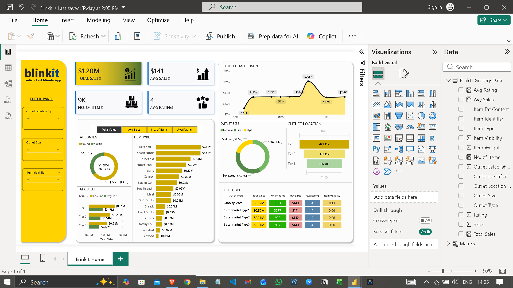

# 🛒 Blinkit Sales Analytics Dashboard

**End-to-end Power BI dashboard analyzing Blinkit grocery sales, outlet performance, and product insights.**

## 🎯 Objective
To analyze retail sales performance and identify key business drivers across outlet types, product categories, and customer behavior.


## 📌 Table of Contents

- [Project Overview](#project-overview)
- [Dashboard Overview](#dashboard-overview)
- [KPI Metrics](#kpi-metrics)
- [Visualizations](#visualizations)
- [Dataset](#dataset)
- [Getting Started](#getting-started)
- [Key Insights](#key-insights)
- [Tools & Technologies](#tools--technologies)
- [Project Structure](#project-structure)
- [Contributing](#contributing)
- [License](#license)

---

## 🗂 Project Overview

This Power BI dashboard provides a comprehensive analysis of **Blinkit's grocery retail operations**, covering sales performance, outlet metrics, and item-level breakdowns. The dashboard is designed to help business stakeholders make data-driven decisions around outlet expansion, product stocking, and pricing strategies.

> **Blinkit** (formerly Grofers) is India's last-minute delivery app, offering rapid grocery delivery across major cities.

---

## 🖥 Dashboard Overview



The dashboard is structured into a single-page interactive report — **Blinkit Home** — featuring filter controls, KPI cards, and multiple chart types for deep-dive analysis.

---

## 📊 KPI Metrics

| Metric | Value | Description |
|---|---|---|
| 💰 **Total Sales** | $1.20M | Overall revenue across all outlets |
| 📦 **No. of Items** | 9,000 | Total SKUs tracked |
| 💵 **Avg Sales** | $141 | Average revenue per transaction |
| ⭐ **Avg Rating** | 4 | Average customer satisfaction score |

---

## 📉 Visualizations

### 1. 🏪 Outlet Establishment Trend
A line/area chart tracking **sales growth from 2010 to 2022**, highlighting key milestones:
- Sales peaked at **$205K** around 2018
- Consistent performance ranging between **$129K – $205K** post-2015
- Gradual growth from **$78K** in early years

### 2. 🍩 Fat Content Analysis
A donut chart segmenting items by fat content:
- **Low Fat** items dominate total sales
- **Regular** fat items contribute a smaller share
- Breakdown also available by outlet tier (Tier 1 / 2 / 3)

### 3. 📦 Item Type Breakdown
A horizontal bar chart ranking categories by sales:

| Category | Sales |
|---|---|
| 🍎 Fruits & Vegetables | $0.18M |
| 🍿 Snack Foods | $0.18M |
| 🏠 Household | $0.14M |
| 🥶 Frozen Foods | $0.12M |
| 🥛 Dairy | $0.10M |
| 🥫 Canned | $0.09M |
| 🥖 Baking Goods | $0.08M |
| 🌿 Health & Hygiene | $0.07M |
| 🥩 Meat | $0.06M |
| 🥤 Soft Drinks | $0.06M |

### 4. 📐 Outlet Size Distribution
A donut chart showing the proportion of sales by outlet size:
- **Medium** outlets: ~$444.79K (37.01%)
- **Small** outlets: ~$248K (20.7%)
- **High** outlets: ~$50K (4.%)

### 5. 🗺 Outlet Location by Tier
A bar chart comparing sales across city tiers:
- **Tier 3**: $472.13K (highest)
- **Tier 2**: $393.15K
- **Tier 1**: $336.40K

### 6. 🏬 Outlet Type Summary Table
A detailed metrics table for each outlet category:

| Outlet Type | Total Sales | No. of Items | Avg Sales | Avg Rating | Item Visibility |
|---|---|---|---|---|---|
| Grocery Store | $0.15M | 1,083 | $140 | 4 | 0.10 |
| Supermarket Type 1 | $0.79M | 5,577 | $141 | 4 | 0.06 |
| Supermarket Type 2 | $0.13M | 928 | $142 | 4 | 0.06 |
| Supermarket Type 3 | $0.13M | 935 | $140 | 4 | 0.06 |

---

## 🗃 Dataset

The dataset used is the **BlinkIT Grocery Data**, containing the following fields:

| Field | Description |
|---|---|
| `Item Identifier` | Unique ID for each product |
| `Item Type` | Product category |
| `Item Fat Content` | Low Fat / Regular |
| `Item Visibility` | Shelf visibility score |
| `Item Weight` | Weight of the product |
| `Outlet Identifier` | Unique ID for each store |
| `Outlet Establishment Year` | Year the outlet was opened |
| `Outlet Location Type` | Tier 1 / Tier 2 / Tier 3 city |
| `Outlet Size` | Small / Medium / High |
| `Outlet Type` | Grocery Store / Supermarket Type |
| `Sales` | Raw sales figure |
| `Total Sales` | Aggregated sales metric |
| `Avg Sales` | Average sales per item |
| `Rating` | Customer rating |
| `Avg Rating` | Aggregated customer rating |
| `No. of Items` | Number of items in each outlet |

---

## 🚀 Getting Started

### Prerequisites

- [Microsoft Power BI Desktop](https://powerbi.microsoft.com/desktop/) (Free)
- The `.pbix` project file from this repository
- Dataset file: `BlinkIT Grocery Data.xlsx`

### Installation

```bash
# 1. Clone the repository
git clone https://github.com/your-username/blinkit-dashboard.git

# 2. Navigate to the project folder
cd blinkit-dashboard
```

### Opening the Dashboard

1. Launch **Power BI Desktop**
2. Click **File → Open Report**
3. Select `Blinkit_Dashboard.pbix`
4. If prompted, update the data source path to point to your local dataset file

### Refreshing Data

```
Home → Refresh
```

---

## 📈 Key Insights

> Derived from visual exploration of the Blinkit dashboard

- 🏆 **Supermarket Type 1** dominates with **$0.79M in total sales** — over 4× any other outlet type
- 🌆 **Tier 3 cities** generate the highest revenue (~$472K), suggesting strong demand in smaller cities
- 📦 **Fruits & Vegetables** and **Snack Foods** are the top-selling categories, each at ~$0.18M
- 📅 Sales peaked in **2018 ($205K)** before stabilizing, indicating market saturation or supply constraints
- ⭐ All outlet types maintain a consistent **Avg Rating of 4**, showing uniform customer satisfaction
- 🏪 **Medium-sized outlets** account for ~37% of all sales — the sweet spot for Blinkit's model
- 🥗 **Low-fat items** account for the majority of product sales, reflecting health-conscious purchasing trends

---

## 🛠 Tools & Technologies

<div align="center">

| Tool | Purpose |
|---|---|
|  | Dashboard creation & visualization |
|  | Raw data source |
|  | Calculated columns and metrics |
|  | Data cleaning and shaping |

</div>

---

## 📁 Project Structure

```
blinkit-dashboard/
│
├── 📊 Blinkit_Dashboard.pbix       # Main Power BI report file
├── 📂 data/
│   └── BlinkIT Grocery Data.xlsx   # Source dataset
├── 📂 assets/
│   └── Blinkit_Dashboard.png       # Dashboard screenshot
└── 📄 README.md                    # Project documentation
```

---

## 🤝 Contributing

Contributions are welcome! If you'd like to improve this dashboard:

1. Fork the repository
2. Create a new branch (`git checkout -b feature/your-feature`)
3. Make your changes
4. Commit (`git commit -m 'Add: your feature description'`)
5. Push to the branch (`git push origin feature/your-feature`)
6. Open a **Pull Request**

---

## 📜 License

This project is licensed under the **MIT License** — see the [LICENSE](LICENSE) file for details.

---

<div align="center">

Made with 💛 using Power BI &nbsp;|&nbsp; Data from BlinkIT Grocery Dataset

⭐ **Star this repo** if you found it useful!

</div>
